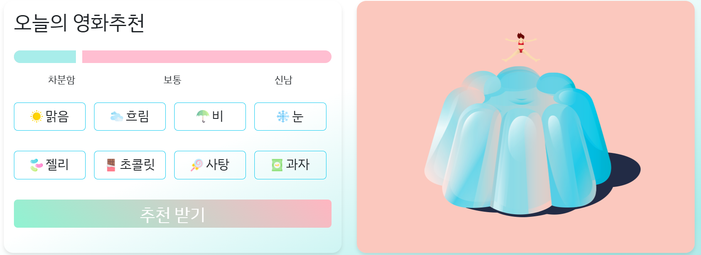
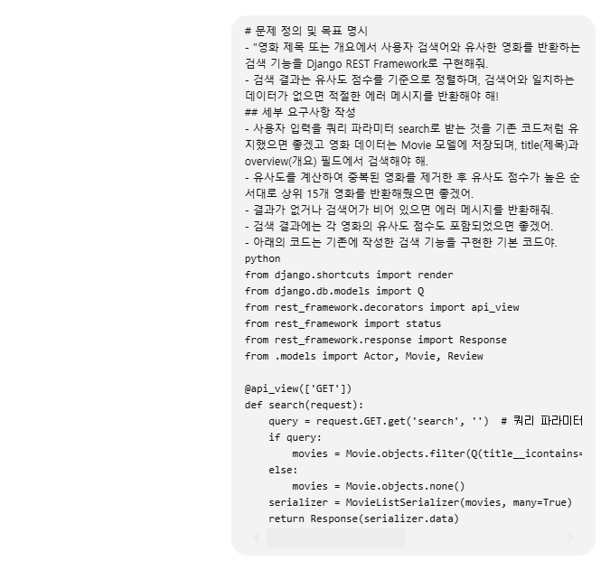
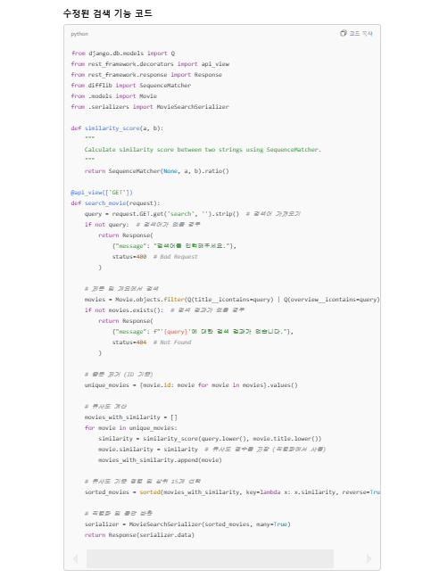
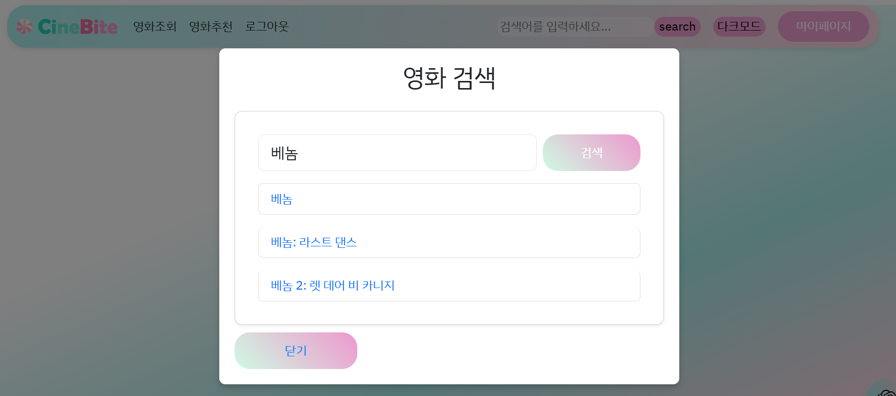
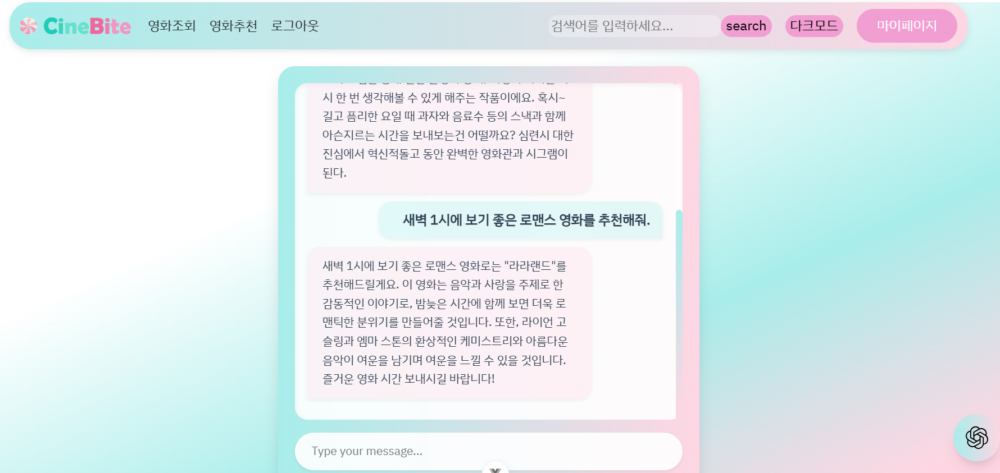
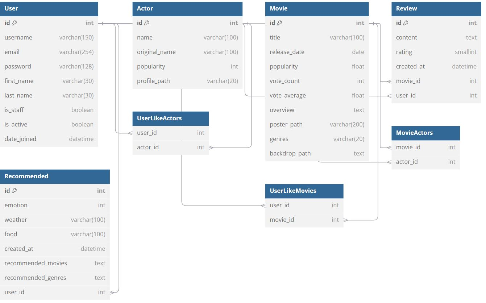
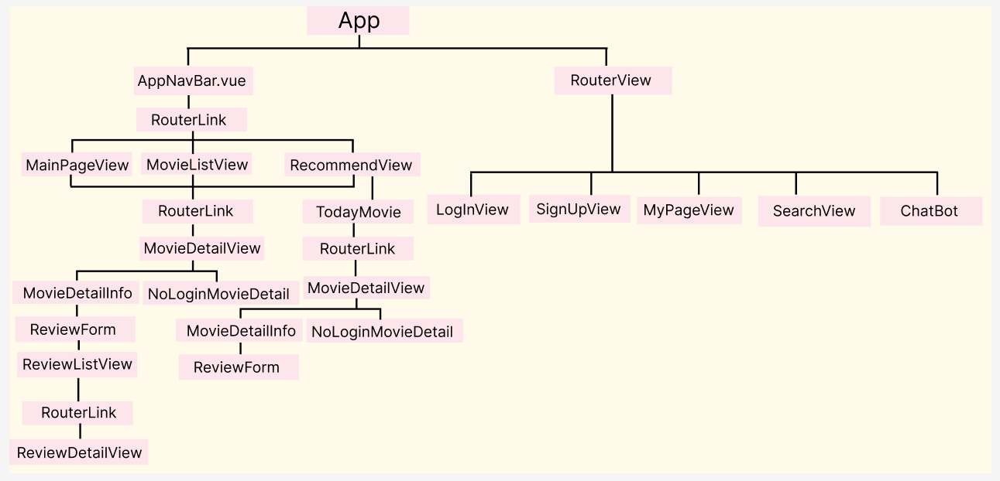
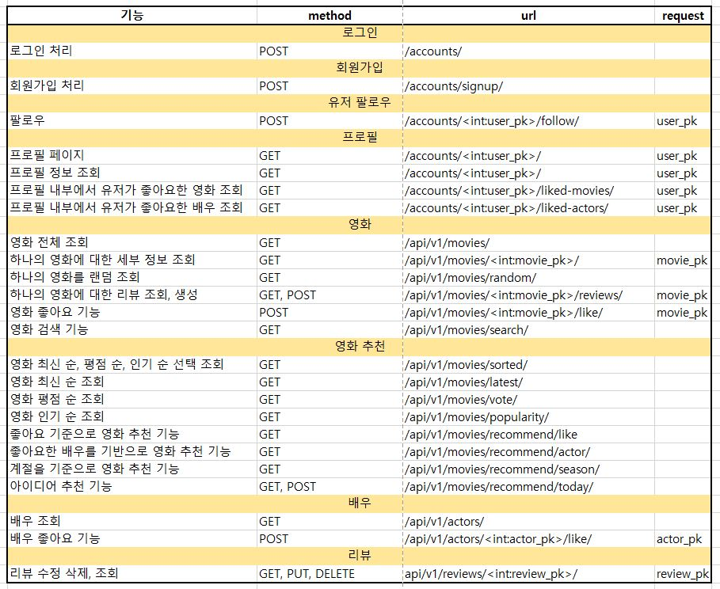
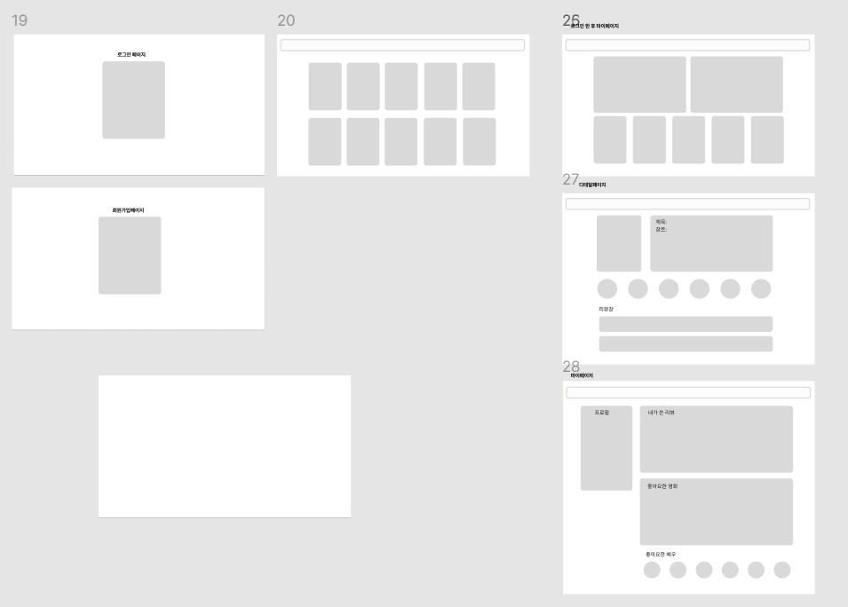

# 영화 추천 알고리즘 기반 커뮤니티 서비스

## CineBite 🍿🎬
CineBite는 사용자의 기분, 날씨, 먹고싶은 간식을 바탕으로 최적의 영화 장르와 영화를 추천하는 맞춤형 영화 추천 알고리즘 기반 커뮤니티 서비스입니다.

### 🏆 SSAFY 12기 1학기 관통 프로젝트

- 일시 : 2024.11.17.(일)  ~ 2024.11.26.(화)


### 🤝 팀원

| 이름          | 담당 영역                                                    | GitLab                       |
| ----------- | ------------------------------------------------------------ | ----------------------------- |
| 최미연        | - 풀스택<br />- 데이터 수집, 프론트엔드 디자인 정교화 |  mu05041  |
| 이지현       | - 풀스택<br />- DB 모델링, 백엔드 데이터 로직 작성 |  w4277   |


### 📝 Description 

- 기분, 날씨, 그리고 좋아하는 간식에 따라 영화 정보 및 맞춤형 영화 추천 서비스 제공 프로젝트입니다. 
- 기획 의도 : CineBite는 간식의 매력을 영화 장르와 결합하여 즐겁고 몰입감 있는 영화 감상 경험을 선사합니다.
- 기획의도: 영화 추천에 감각적 요소를 더해 사용자가 간식과 함께 완벽한 영화 경험을 즐길 수 있도록 기획되었습니다.
  


### 🥇 GOAL

- 영화 데이터 및 사용자 데이터 기반 추천 서비스 구성
- 커뮤니티 서비스 구성
- HTML, CSS, JavaScript, Bootstrap, Vue.js, REST API, Database 등을 활용한 실제 서비스 설계
1. 개발자로서의 성장
- 챗GPT에 의존하지 않고, 팀원과 함께 스스로의 힘으로 프로젝트를 완성하며 협업 능력과 개발자로서의 실력을 키우는 것을 목표로 삼았습니다.
2. 서비스의 완성도
- 단순한 영화 추천을 넘어, 사용자의 기분, 날씨, 간식 등 개인의 취향과 순간의 감각을 반영하여 더 즐겁고 특별한 영화 감상 경험을 제공하는 서비스를 만드는 데 중점을 두었습니다.


### 💻 필수 요구사항 

| No.  | 구분               | 기능                                 | 구현 정도(⭐⭐⭐⭐⭐)                               |
| ---- | ------------------ | ------------------------------------ | -----------------------------------------------------|
| 1    | 영화 데이터         | 영화 정보 데이터 약 800개 로드, 각 영화당 배우 6명씩 추가 로드<br />->fixtures 파일에 actors.json movies.json 으로 데이터 저장        | ⭐⭐⭐⭐⭐                       |
| 2    | 영화 추천 알고리즘            |  3개 이상의 추천 방식 사용, <br /> 랜덤 추천, 계절별 추천, 유저 정보를 기반으로 한 영화 추천        | ⭐⭐⭐⭐⭐    |
| 3    |  API               |  TMDB API, Chat GPT API         | ⭐⭐⭐⭐⭐                                              |
| 4    | 커뮤니티            |  리뷰 기능과 좋아요, 팔로우 기능        | ⭐⭐⭐⭐⭐                                        |

### 🎨 목표 서비스 구현 및 실제 구현 정도

| No   | 기능                                                         | 기능 설명                                                     | 구현 정도(⭐⭐⭐⭐⭐) | 실제 구현 수준                             |
| ---- | ------------------------------------------------ | ------------------------------------------------- | ---------------- | ------------------------------------------ |
| 1    | 로그인             | all auth를 통한 로그인 기능 구현                | ⭐⭐⭐⭐⭐          |    all auth를 통한 로그인 기능 구현                                                 |
| 2    | 로그아웃              | all auth를 통한 로그아웃 기능 구현                              | ⭐⭐⭐⭐⭐            |             all auth를 통한 로그아웃 기능 구현                      |
| 3    | 회원가입         | all auth를 통한 회원가입 기능 구현           | ⭐⭐⭐⭐⭐      |   username과 email, password 으로 회원 가입 가능        |
| 4    | 마이페이지         | 사용자 정보 조회, 다른 사용자 팔로우 기능, <br /> 사용자가 작성한 리뷰 조회, <br /> 좋아요한 영화와 배우를 모아보기 및 좋아요 취소 제공, 좋아요 취소 시 비동기적으로 즉시 반영        | ⭐⭐⭐⭐      | 사용자 정보 조회, 다른 사용자 팔로우 기능, 사용자가 작성한 리뷰 조회해서 수정, 삭제 기능까지 구현 성공, 좋아요한 영화와 배우를 모아보기 및 좋아요 취소 제공, 좋아요 취소 시 비동기적으로 즉시 반영에 성공했지만 영화 디테일 페이지에 좋아요 기능이 잘 반영되지 않는 문제점 발생 |
| 5    | 메인페이지의 특성  | 사용자에게 재미와 실용성을 제공하기 위해 움직이는 사탕을 클릭하면 랜덤으로 영화를 추천하는 기능 구현 | ⭐⭐⭐⭐⭐ | 랜덤으로 영화를 추천받고 싶어하는 사용자를 위해 기존의 영화 추천 웹페이지와 차별화된 기능 구현| 
| 6    | 메인페이지에 영화 필터링 기능       | 메인페이지에 카드 카로셀 방식으로 사용자가 최신순, 평점순, 인기순으로 영화를 조회할 수 있도록 구현       | ⭐⭐⭐⭐⭐         |  1개의 카로셀에 6개의 영화가 나오게 해서 사용자에게 최신순, 평점순, 인기순으로 30개의 영화를 조회할 수 있도록 구현                 | 
| 7    | 영화 조회 페이지 | 전체 영화 중 영화를 랜덤으로 추천하되, 다양한 장르가 고르게 추천되도록 구현, 국내, 해외 영화의 비율을 50:50으로 설정되어 균형되게 영화의 제목, 포스터, 평점 조회 |  ⭐⭐⭐ | 랜덤으로 12개의 영화 추천에 성공했지만 장르의 비율과 국내, 해외 영화의 비율을 계산하는 로직 구현 실패 |
| 8   | 영화 추천 페이지    |  사용자가 입력한 기분, 날씨, 간식을 바탕으로 개인 맞춤형 영화 추천 시스템 구현      | ⭐⭐⭐⭐⭐    |   사용자가 입력한 기분, 날씨, 간식을 바탕으로 각 항목에 가중치를 부여하여, 그에 맞는 영화 장르를 필터링한 후 상위 3개의 장르를 추천하고, 각 장르에 맞는 영화 12개를 제시하는 개인 맞춤형 영화 추천 시스템 구현 성공 + 사용자의 정보 입력 받기 전 계절 기반 영화 추천 로직 구현        |
| 9   | 영화 좋아요 기능      | 전체 영화 조회 화면, 영화 상세 페이지 화면에 좋아요 기능 구현 및 좋아요 상태 유지        | ⭐⭐⭐          |  전체 영화 조회 화면, 영화 상세 페이지 화면에 좋아요 기능 구현했지만 영화의 좋아요 상태 유지 일부 성공              |
| 10   | 영화 상세 페이지에서 로그인 상태와 비로그인 상태에 따라 화면을 다르게 출력하기      | 영화 정보 페이지에서는 로그인한 사용자에게 리뷰 작성 및 좋아요 기능을 제공하고, 비로그인한 사용자에게는 영화의 제목, 줄거리 등 기본 정보만 출력되도록 구현 | ⭐⭐⭐⭐⭐         | 영화 정보 페이지에서는 컴포넌트를 분리해서 로그인의 여부에 따라 로그인한 사용자에게 리뷰 작성 및 좋아요 기능을 제공하고, 비로그인한 사용자에게는 영화의 제목, 줄거리 등 기본 정보만 출력되도록 구현   |
| 11   | 리뷰 생성, 수정, 조회 기능     |  게시글 생성, 조회, 수정, 삭제는 로그인한 사용자만 가능하며, 사용자는 자신의 데이터에 대해서만 추가 작업을 수행 | ⭐⭐⭐  |게시글 생성, 조회, 수정, 삭제는 로그인한 사용자만 가능하며, 사용자는 자신의 데이터에 대해서만 추가 작업을 수행       |
| 12   |  영화 상세 페이지에서 각 영화별 작성된 리뷰 목록 조회      |   개별 영화 상세 페이지에서 해당 영화와 관련된 리뷰 조회 및 리뷰 수정, 삭제 기능 구현   | ⭐⭐⭐⭐⭐            | 리뷰 기능은 평점과 내용을 작성할 수 있도록 구현, 개별 영화 상세 페이지에서 리뷰 작성 버튼을 제공하고, 작성된 리뷰 목록 조회 가능하고 각 리뷰는 상세 조회, 수정, 삭제가 가능하도록 기능 구현           |
| 13   | 영화에 출현한 배우 조회 | 배우 데이터를 불러와서 영화 상세 페이지에서 영화에 출현한 배우 조회 기능 구현 | ⭐⭐⭐⭐⭐   | 영화 상세 페이지에 영화에 출현한 주연 및 조연 배우 6명의 이름, 사진의 기본적인 정보 조회 기능 구현 | 
| 14   | 배우 좋아요 기능 | 배우 좋아요 기능을 통해 좋아요한 배우의 다른 영화 추천 로직 구현 | ⭐⭐⭐⭐⭐   | 영화 상세 페이지에 조회되는 배우의 좋아요 기능을 구현하여 영화 추천 페이지에 사용자가 좋아요한 배우의 다른 영화 작품을 추천하는 기능 구현 성공 | 
| 15   | 검색 기능      |  네이게이션바에 검색 기능을 추가하여 로그인한 사용자, 비로그인한 사용자 모두에게 실제 웹 페이지와 유사한 검색 기능 제공 + 검색한 영화 제목을 클릭하면 영화 상세 페이지로 이동             |   ⭐⭐⭐⭐     |  네비게이션 바에 검색 기능을 추가하여 로그인한 사용자와 비로그인한 사용자 모두에게 제공했지만, 검색어와 입력 값이 양방향 바인딩되지 않고, 사용자가 검색어를 입력한 후 Enter 키를 누르면 검색 모달 폼이 열리지만, 현재 페이지가 아닌 흰 배경 페이지에서 모달이 열리는 문제 발생                             |
| 16   | 다크모드                   |  다크모드 버튼을 클릭해서 다크모드 적용                    |  ⭐⭐⭐⭐⭐       | 다크모드 버튼을 클릭해서 다크모드 적용 성공        |
| 17    | 챗봇 | 챗GPT API를 통해 챗봇 기능 구현 + 영화 상세 페이지와 연동 |   ⭐⭐⭐⭐ | 페이지 하단에 ChatGPT API를 활용한 챗봇을 구성하여 AI를 통해 영화를 추천받을 수 있도록 구현에 성공했지만 영화 상세 페이지와 연동 실패 |

### 🧠 영화 추천 알고리즘에 대한 기술적 설명

- 영화 추천 알고리즘은 사용자의 입력(기분, 날씨, 음식)을 기반으로 적합한 영화 장르를 추천하고, 그에 맞는 영화를 제시하는 방식으로 구현됩니다. 각 입력값에 대해 적합한 장르를 설정하고, 해당 장르에 맞는 영화들을 추천하는 구조입니다.

1. 기본 기준 설정
- 기분 (Emotion): 사용자의 기분에 따라 추천할 영화 장르를 결정합니다. 예를 들어, 기분이 좋으면 활기차고 긍정적인 영화(코미디, 액션, 모험 등)를 추천하고, 기분이 우울하면 감성적인 영화(드라마, 로맨스 등)를 추천할 수 있습니다.

- 날씨 (Weather): 날씨에 따라 영화 장르를 추천합니다. 비 오는 날에는 로맨스나 드라마와 같이 감성적이고 여유로운 분위기의 영화를, 맑고 화창한 날에는 액션, 모험 등 활기차고 다이내믹한 장르를 추천할 수 있습니다.

- 음식 (Food): 저희는 간식을 음식으로 정해서 간식의 특성에 맞는 영화 장르를 추천합니다. 간식의 맛과 느낌을 영화 장르에 연결하여 추천하는 방식입니다.

2. 음식별 영화 장르 추천

- 젤리 (부드럽고 상큼한 맛, 다양한 색상과 형태)
  - 영화 장르: 로맨스, 드라마, 코미디
  - 추천 이유: 젤리의 부드럽고 상큼한 특성은 감정적으로 부드럽게 변하는 이야기나 사랑의 감정을 중심으로 하는 영화와 잘 어울립니다. 또한, 다양한 색상과 형태가 주는 즐거움은 밝고 유쾌한 코미디 영화에도 잘 맞습니다.

- 초콜릿 (진하고 고급스러운 맛, 다양한 종류)
  - 영화 장르: 드라마, 로맨스, 감성적인 영화
  - 추천 이유: 초콜릿의 고급스러움과 깊은 맛은 감성적이고 복잡한 감정을 다루는 영화, 특히 진지한 감동을 주는 드라마와 로맨스 장르와 잘 맞습니다. 초콜릿처럼 다양한 층을 가진 감정을 가진 영화들이 적합합니다.
- 과자 (비스킷, 쿠키 등) (가벼운 질감, 다양한 맛, 쉽게 나누어 먹는 특성)
  - 영화 장르: 가족 영화, 애니메이션, 코미디
  - 추천 이유: 과자의 가벼운 질감은 부담 없이 즐길 수 있는 영화를 연상시킵니다. 가족과 함께 보기 좋고, 온 가족이 웃을 수 있는 애니메이션 영화나 유쾌한 코미디 영화와 잘 맞습니다. 또한, 다양한 맛을 즐길 수 있는 과자는 다양한 캐릭터가 등장하는 애니메이션이나 가족 영화와도 잘 어울립니다.
- 사탕 (강렬하고 달콤한 맛, 입 안에서 오랫동안 즐길 수 있는 특성)
  - 영화 장르: 모험, 판타지, 액션
  - 추천 이유: 사탕의 강렬한 맛은 역동적이고 다채로운 경험을 제공하는 영화와 잘 맞습니다. 사탕처럼 감각적으로 강렬한 경험을 주는 모험, 판타지, 액션 영화들이 사탕의 특성과 잘 어울립니다. 또한, 사탕처럼 다채롭고 신비로운 요소가 있는 영화들이 적합합니다.
- 커피 (진하고 쌉싸름한 맛, 에너지를 주는 느낌)
  - 영화 장르: 스릴러, 미스터리, 범죄
  - 추천 이유: 커피의 진하고 쌉싸름한 맛은 긴장감 넘치는 스릴러나 미스터리 장르와 잘 맞습니다. 커피처럼 속을 꽉 채우는 복잡한 스토리라인과 빠른 템포를 가진 영화들이 어울립니다. 커피를 마시며 집중하게 되는 것처럼, 이런 장르의 영화들은 관객을 몰입시킵니다.

3. 영화 장르 매칭
- 영화 장르는 총 18가지로 구분되며, 각 장르는 특정 감정이나 상황에 맞게 추천됩니다:

- SF, 액션, 모험, 스릴러, 공포: 기분이 활기차고, 날씨가 맑거나 모험적일 때 추천됩니다.
- 드라마, 로맨스, 멜로, 가족, 애니메이션: 기분이 감성적이고 편안한 상황에서 추천됩니다.
- 범죄, 미스터리, 판타지, 서부, 음악, 다큐멘터리, 역사, 전쟁: 다양한 감정과 상황에 따라 선택할 수 있는 장르들입니다.

4. 알고리즘 흐름
- 입력 값 수집: 사용자의 기분, 날씨, 음식 선택을 받습니다.
- 장르 추천: 각 입력 값에 따라 해당하는 영화 장르를 추천합니다. 
- 추천 영화 제시: 추천된 장르에 맞는 영화를 데이터베이스에서 불러와 사용자에게 추천합니다.

### 🤔 핵심 기능에 대한 설명 

#### 메인페이지의 재미적 요소
- 메인페이지에 사용자에게 재미와 실용성을 동시에 제공하기 위해 간식을 컨셉으로 한 움직이는 사탕 요소를 추가하였습니다. 
- 사탕을 클릭하면 랜덤으로 영화가 추천되며, 추천된 영화의 상세 페이지로 이동할 수 있는 기능을 구현했습니다.
- 기존 영화 추천 웹페이지와는 차별화된 방식으로, 랜덤 추천 기능을 통해 사용자에게 색다른 영화 경험을 제공함과 동시에, 인터랙티브한 요소로 웹 사용의 재미를 더욱 극대화하기 위해 노력했습니다.


```python
# 랜덤으로 한 영화를 추천
@api_view(['GET'])
def movie_random_detail(request, movie_pk=None):
    # movie_pk가 없으면 랜덤으로 선택
    if movie_pk is None:
        movie_count = Movie.objects.count()
        if movie_count == 0:
            return Response({"error": "No movies available."}, status=404)
        random_index = random.randint(0, movie_count - 1)
        movie = Movie.objects.all()[random_index]
    else:
        movie = get_object_or_404(Movie, pk=movie_pk)

    serializer = MovieSerializer(movie)
    return Response(serializer.data)
```

#### 영화 추천 로직
##### 사용자의 취향 기반 영화 추천
###### 1. 영화 좋아요 기반 영화 추천
- 사용자가 좋아한 영화의 장르에 기반해, 사용자가 아직 좋아요를 누르지 않은 비슷한 장르의 영화를 추천하는 로직을 구현했습니다.
- 각 장르의 비율에 맞춰 추천 영화 수를 정하고, 중복을 피하며 최종적으로 15개의 추천 영화를 무작위로 반환하는 방식입니다.
```python
@api_view(['GET'])
def recommend_like_movies(request):
    # 인증된 사용자만 접근 가능
    if not request.user.is_authenticated:
        return Response({'detail': 'Authentication credentials were not provided.'}, status=401)
    
    # 사용자가 좋아요를 누른 영화들을 가져옴
    liked_movies = request.user.like_movies.all()
    
    # 사용자가 좋아한 영화들의 장르 추출
    liked_genres = liked_movies.values_list('genres', flat=True)
    
    # 장르별 비율 계산
    genre_count = Counter(liked_genres)
    total_genres = len(liked_genres)
    
    # 각 장르의 비율 계산 (0과 나누는 에러 방지)
    genre_ratio = {genre: count / total_genres for genre, count in genre_count.items()}
    
    # 추천 영화들을 담을 리스트
    recommended_movies = []
    
    # 장르 비율에 맞춰 추천 영화 추출
    for genre, ratio in genre_ratio.items():
        # 장르에 맞는 영화를 찾고, 사용자가 아직 좋아요를 누르지 않은 영화를 필터링
        genre_movies = Movie.objects.filter(genres=genre).exclude(like_users=request.user)
        
        # 추천할 영화 수를 비율에 맞춰 결정 (최대 15개 추천)
        num_recommended = int(ratio * 15)
        num_recommended = max(num_recommended, 3)  # 최소 1개 영화는 추천
        
         # 무작위로 선택 (단, 영화 수가 부족할 경우 최대 가능한 수만 선택)
        genre_movies = list(genre_movies)
        if genre_movies:
            sampled_movies = random.sample(genre_movies, min(len(genre_movies), num_recommended))
            recommended_movies.extend(sampled_movies)
    
    # 추천 영화들을 직렬화
    recommended_movies = list(set(recommended_movies))  # 중복 제거
    recommended_movies = random.sample(recommended_movies, min(len(recommended_movies), 15)) 
    
    # 직렬화
    serializer = MovieSerializer(recommended_movies, many=True)
    return Response(serializer.data)
```

###### 2. 배우 좋아요 기반 배우의 다른 영화 추천 기능 
- 사용자가 좋아한 배우들의 영화 중에서, 사용자가 아직 좋아요를 누르지 않은 영화들을 추천하는 기능입니다. 
- 각 배우에 대해 최대 3개의 영화를 무작위로 선택하고, 중복을 피하며 최종적으로 최대 15개의 영화를 추천합니다.
```python
@api_view(['GET'])
def recommend_like_actors(request):
      # 인증된 사용자만 접근 가능
    if not request.user.is_authenticated:
        return Response({'detail': 'Authentication credentials were not provided.'}, status=401)
    
    # 사용자가 좋아요를 배우들을 가져옴
    liked_actors = request.user.like_actors.all()
    
    # 추천할 영화들을 담을 리스트
    recommended_movies = []
    
    # 사용자가 좋아요한 배우들의 다른 영화들을 추천
    for actor in liked_actors:
        # 해당 배우가 출연한 영화들 가져오기
        actor_movies = Movie.objects.filter(actors=actor).exclude(like_users=request.user)
        
        # 추천할 영화들을 비율에 맞춰 추출 (최대 15개 추천)
        num_recommended = min(len(actor_movies), 3)  # 최소 1개 영화는 추천
        
        # 무작위로 선택 (단, 영화 수가 부족할 경우 최대 가능한 수만 선택)
        actor_movies = list(actor_movies)
        if actor_movies:
            sampled_movies = random.sample(actor_movies, num_recommended)
            recommended_movies.extend(sampled_movies)
    
    # 추천 영화들을 직렬화
    recommended_movies = list(set(recommended_movies))  # 중복 제거
    recommended_movies = random.sample(recommended_movies, min(len(recommended_movies), 15))

    # 직렬화
    serializer = MovieSerializer(recommended_movies, many=True)
    return Response(serializer.data)
```

##### 최신순, 인기순, 평점순으로 영화 추천
- 최신순으로 영화를 추천할 때 영화 데이터에 개봉 예정 영화가 포함되어 있어 현재 날짜를 기준으로 이전에 개봉한 최신 영화 30개를 반환하도록 구현했습니다.
- 인기순과 평점순은 각각 영화 목록을 인기순 및 평점순으로 정렬하고, 상위 30개 영화를 반환하여, 사용자가 원하는 기준에 맞는 영화를 추천하도록 했습니다.
```python
@api_view(['GET'])
def movie_latest(request):
    today = datetime.now().date()  # 현재 날짜
    # 오늘 이전에 개봉한 영화만 포함
    movies = Movie.objects.filter(release_date__lte=today).order_by('-release_date')[:30]
    # 시리얼라이저를 사용하여 데이터 직렬화
    serializer = MovieListSerializer(movies, many=True)

    # JSON 응답 반환
    return Response(serializer.data)


@api_view(['GET'])
def movie_popularity(request):
    movies = Movie.objects.order_by('-popularity')[:30]  # 인기순
    # 시리얼라이저를 사용하여 데이터 직렬화
    serializer = MovieListSerializer(movies, many=True)
    # JSON 응답 반환
    return Response(serializer.data)


@api_view(['GET'])
def movie_vote(request):
    movies = Movie.objects.order_by('-vote_average')[:30]  # 평점순
    # 시리얼라이저를 사용하여 데이터 직렬화
    serializer = MovieListSerializer(movies, many=True)
    # JSON 응답 반환
    return Response(serializer.data)
```

##### 계절에 맞는 장르를 기반으로 영화 추천
- 사용자가 요청할 때 현재 계절에 맞는 영화 장르를 기반으로 추천된 영화 목록을 반환하는 기능을 구현했습니다.
- 계절에 맞는 영화 장르를 설정할 때, 각 계절의 분위기와 관련된 일반적인 영화 장르 경향을 참고했습니다.
```python
# 계절에 따른 영화 추천 기능
def get_season():
    month = datetime.now().month
    if 3 <= month <= 5:
        return "봄"  # 봄
    elif 6 <= month <= 8:
        return "여름"  # 여름
    elif 9 <= month <= 11:
        return "가을"  # 가을
    else:
        return "겨울"  # 겨울

def get_seasonal_genre(season):
    seasonal_genres = {
        "spring": ["로맨스", "드라마"],
        "summer": ["액션", "모험", "스릴러", "코미디"],
        "autumn": ["미스터리", "SF", "드라마", "스릴러", "역사"],
        "winter": ["코미디", "로맨스", "가족", "애니메이션"]
    }
    return seasonal_genres.get(season, [])

@api_view(['GET'])
def recommend_season(request):
    # 현재 계절을 가져옴
    season = get_season()
    # 계절에 맞는 영화 장르 목록을 가져옴
    genres = get_seasonal_genre(season)

    # Q 객체를 사용하여 여러 장르에 대해 OR 조건을 생성
    q = Q()
    for genre in genres:
        q |= Q(genres__contains=genre)
    
    # 영화 필터링: 계절에 맞는 장르가 하나라도 포함된 영화들만 필터링
    recommended_movies = list(Movie.objects.filter(q))
    
    # 랜덤으로 15개의 영화를 선택 (단, 영화 데이터가 15개 미만일 경우 모든 영화 반환)
    recommended_movies = random.sample(recommended_movies, min(len(recommended_movies), 15))

    # MovieSerializer와 연관해서 필터링
    serializer = MovieSerializer(recommended_movies, many=True)
    
    # 계절 정보와 추천된 영화 목록을 반환
    return Response({
        'season': season,
        'recommended_movies': serializer.data
    })
```

##### 사용자가 입력한 정보를 기반으로 영화 추천
- 사용자가 제공한 정보를 바탕으로 영화를 추천할 수 있도록 모델을 설계했습니다.
- 사용자가 입력한 감정(emotion), 날씨(weather), 음식(food) 정보를 바탕으로 각 항목에 맞는 가중치를 반영하여 영화 장르 추천 점수를 계산하고, 이를 통해 영화를 추천하도록 기능을 구현했습니다. 
- 영화 장르 추천 점수는 각 영화 장르를 키(key)로, 해당 장르의 추천 점수를 값(value)으로 저장하는 genre_scores라는 딕셔너리를 생성하여 관리하였습니다. 
- 계산된 상위 3개 장르를 기준으로, 영화 모델에서 해당 장르를 가진 영화를 필터링하여 사용자에게 맞춤화된 영화 추천을 제공합니다.



```python
class Recommended(models.Model):
    user = models.ForeignKey(settings.AUTH_USER_MODEL, on_delete=models.CASCADE, related_name="recommends")
    emotion = models.IntegerField(null=True)  # 사용자의 기분 (1~100 범위로 저장)
    weather = models.CharField(max_length=100)  # 날씨 
    food = models.CharField(max_length=100)  # 음식
    created_at = models.DateTimeField(auto_now_add=True)  # 저장 시간
    recommended_movies = models.TextField(blank=True, null=True)
    recommended_genres = models.TextField(blank=True, null=True)
```
```python
from rest_framework.response import Response
from rest_framework.decorators import api_view
import random
from collections import defaultdict
from .serializers import MovieSerializer, TodaySerializer
from .models import Movie, Recommended
from rest_framework import status
from django.db.models import Q


@api_view(['GET', 'POST'])
def today(request):
    if request.method == 'GET':
        recommended = Recommended.objects.all()
        serializer = TodaySerializer(recommended, many=True)
        return Response(serializer.data)
    
    elif request.method == 'POST':
        serializer = TodaySerializer(data=request.data)
        print("Received POST request with data:", request.data)
        
        # 감정, 날씨, 음식 정보 저장 및 장르 추천 로직
        if serializer.is_valid(raise_exception=True):
            emotion = serializer.validated_data['emotion']
            weather = serializer.validated_data['weather']
            food = serializer.validated_data['food']
            
            # 기본 장르 추천 기준 설정
            genre_scores = defaultdict(int)
            genres = []

            # 기분에 따른 장르 점수 추가
            if emotion > 70:
                genre_scores['액션'] += 30
                genre_scores['코미디'] += 30
                genre_scores['애니메이션'] += 20
                genres.extend(['액션', '코미디', '애니메이션'])
            elif emotion < 30:
                genre_scores['코미디'] += 20
                genre_scores['다큐멘터리'] += 40
                genre_scores['음악'] += 30
                genres.extend(['코미디', '다큐멘터리', '음악'])
            else:
                genre_scores['스릴러'] += 20
                genre_scores['미스터리'] += 20
                genre_scores['로맨스'] += 20
                genres.extend(['스릴러', '미스터리', '로맨스'])

            # 날씨에 따른 장르 점수 추가
            if weather == '맑음':
                genre_scores['액션'] += 20
                genre_scores['모험'] += 20
                genres.extend(['액션', '모험'])
            elif weather == '비':
                genre_scores['스릴러'] += 30
                genre_scores['미스터리'] += 20
                genre_scores['SF'] += 20
                genre_scores['공포'] += 20
                genres.extend(['스릴러', '미스터리', 'SF', '공포'])
            elif weather == '흐림':
                genre_scores['판타지'] += 20
                genre_scores['전쟁'] += 30
                genre_scores['범죄'] += 30
                genres.extend(['판타지', '전쟁', '범죄'])
            elif weather == '눈':
                genre_scores['음악'] += 20
                genre_scores['가족'] += 30
                genre_scores['역사'] += 20
                genres.extend(['음악', '가족', '역사'])
            
            # 음식에 따른 장르 점수 추가
            if food == '젤리':  # 젤리
                genre_scores['드라마'] += 20
                genre_scores['액션'] += 30
                genres.extend(['드라마', '액션'])
            elif food == '초콜릿':  # 초콜릿
                genre_scores['로맨스'] += 20
                genre_scores['멜로'] += 30
                genres.extend(['멜로', '로맨스'])
            elif food == '과자':  # 과자
                genre_scores['애니메이션'] += 25
                genre_scores['가족'] += 40
                genre_scores['다큐멘터리'] += 30
                genre_scores['역사'] += 20
                genres.extend(['애니메이션', '가족', '다큐멘터리', '역사'])
            elif food == '사탕':  # 사탕
                genre_scores['모험'] += 30
                genre_scores['판타지'] += 20
                genre_scores['스릴러'] += 20
                genres.extend(['모험', '판타지', '스릴러'])


            # 장르 점수 높은 순으로 정렬 후 상위 3개의 장르 선택
            sorted_genres = sorted(genre_scores.items(), key=lambda x: x[1], reverse=True)
            genres = [genre for genre, score in sorted_genres[:3]]
            print("Final genres:", genres)  

            # 장르 점수 비율 계산
            total_score = sum(genre_scores.values())
            if total_score == 0:
                return Response({"detail": "No valid genre scores."}, status=status.HTTP_400_BAD_REQUEST)

            # Q 객체를 사용하여 여러 장르에 대해 OR 조건을 생성
            q = Q()
            for genre in genres:
                q |= Q(genres__contains=genre)

            # 필터링된 영화들을 랜덤으로 15개 추천
            recommended_movies = Movie.objects.filter(q)

            # 추천된 영화가 12개 이상일 경우 랜덤으로 12개 선택 (영화가 12개 미만일 경우 모두 반환)
            recommended_movies = random.sample(list(recommended_movies), min(len(recommended_movies), 12))

            # 추천된 영화들 직렬화
            movie_serializer = MovieSerializer(recommended_movies, many=True)

            # 추천 정보를 DB에 저장
            recommended_instance = Recommended.objects.create(
                user=request.user, 
                emotion=emotion, 
                weather=weather, 
                food=food,
                recommended_movies=recommended_movies,  # 추천된 영화들을 저장
                recommended_genres=genres,
            )

             # 저장된 인스턴스 직렬화
            today_serializer = TodaySerializer(recommended_instance)

            return Response({ 
                'recommended_genres': genres,
                'recommended_movies': movie_serializer.data,
                'today_serializer': today_serializer.data }
                , status=status.HTTP_200_OK)

```

### 🤖 생성형 AI를 활용한 부분

#### 생성형 AI를 활용하여 프롬프트 엔지니어링 통한 기능 구현
- 관통 프로젝트 7-pjt에서 했던 도전과제의 코드를 활용하여 검색 기능을 완성하고 싶었습니다.
```python
from django.shortcuts import render
from django.db.models import Q
from rest_framework.decorators import api_view
from rest_framework import status
from rest_framework.response import Response
from .models import Actor, Movie, Review

@api_view(['GET'])
def search(request):
    query = request.GET.get('search', '')  # 쿼리 파라미터에서 검색어 가져오기
    if query:
        movies = Movie.objects.filter(Q(title__icontains=query) | Q(overview__icontains=query))  # 제목 또는 개요에서 검색
    else:
        movies = Movie.objects.none()
    serializer = MovieListSerializer(movies, many=True)
    return Response(serializer.data)
```
- 위의 코드는 단순하게 영화 데이터베이스에서 사용자가 입력한 검색어에 따라 관련 영화를 조회하는 기능으로, 만약 검색어가 제공되지 않았다면 기본값으로 빈 문자열을 사용했습니다.
- 영화 검색 기능을 구현하기 위해 ChatGPT를 이용했습니다.





- 프롬프트 엔지니어링을 통해 완성된 영화 검색 기능은 다음과 같습니다.
```python
# 영화 검색 기능
def similarity_score(a, b):
    """Calculate similarity score between two strings."""
    return SequenceMatcher(None, a, b).ratio()


@api_view(['GET'])
def search_movie(request):
    query = request.GET.get('search', '').strip()  # 쿼리 파라미터에서 검색어 가져오기
    if not query:  # 검색어가 없거나 빈 문자열인 경우
        return Response(
            {"message": "검색어를 입력해주세요."},
            status=400  # Bad Request
        )

    # 제목 또는 개요에서 검색
    movies = Movie.objects.filter(Q(title__icontains=query) | Q(overview__icontains=query))
    if not movies.exists():  # 검색 결과가 없는 경우
        return Response(
            {"message": f"'{query}'에 대한 검색 결과가 없습니다."},
            status=404  # Not Found
        )

    # 중복 제거 (중복 영화를 제거)
    unique_movies = {movie.id: movie for movie in movies}.values()

    # 유사도 계산 및 정렬
    movies_with_similarity = []
    for movie in unique_movies:
        similarity = similarity_score(query.lower(), movie.title.lower())
        movie.similarity = similarity  # `MovieSearchSerializer`의 `similarity` 필드 사용
        movies_with_similarity.append(movie)

    # 유사도 기준으로 정렬
    sorted_movies = sorted(movies_with_similarity, key=lambda x: x.similarity, reverse=True)[:15]

    # 직렬화 및 응답 반환
    serializer = MovieSearchSerializer(sorted_movies, many=True)
    return Response(serializer.data)
```




#### 웹 페이지에 생성형 AI 기능을 통합
- OpenAI의 GPT API를 활용하여 사용자와 상호작용하는 챗봇 기능을 웹 페이지에 통합했습니다.
- 사용자가 입력한 메시지에 대해 챗봇이 응답을 생성하여 대화가 이루어지도록 구현되었습니다.





### 🛠Tech Stack


### 💾 데이터베이스 모델링(ERD)



### 🔲 컴포넌트 구조



### 🔗 URL 명세



### 💡 UX/UI 설계




### 📅 개발일지 및 업무 분담 내역
 
| 날짜                | 세부 역할            |  담당자   |  
| ----------------- | -------------- | ------------------------------------ | 
|  11-17(일)  | - ERD 구성하기<br /> - 컴포넌트 설계하기<br /> - UX/UI 설계하기	     |  최미연,<br />이지현   |
|                |- vue 프로젝트 생성 <br /> - 피그마 설계	      |   최미연   |
|             | - 로그인 기능 <br /> - 회원가입 기능 <br /> - 로그아웃 기능<br /> - 회원가입 / 로그인 시 토큰 인증   | 이지현  |
| 11-18(월)  | - 영화 목록 조회 <br /> - 단일 영화 조회 <br /> - 영화 목록 조회 페이지<br /> - 단일 영화 조회 페이지<br /> - 단일 영화 조회 페이지 밑에 영화에 대한 리뷰 출력    |   	이지현    |
|                    |	- 데이터 TMDB에서 불러오기<br /> - 리뷰 CRUD → 리뷰 작성, 리뷰 조회, 리뷰 수정, 리뷰 삭제<br />  - 관객 순(popularity) 영화 목록 조회<br /> - 메인 페이지 디자인<br /> - 네비게이션 바 디자인	|  최미연  |
| 11-19(화)   |	- 리뷰 작성하는 폼 구현<br /> - 리뷰 조회, 수정, 삭제 버튼 구현<br /> - 좋아요 버튼 전체 영화 목록 조회 페이지에 구현<br /> - 좋아요 기능 구현 | 이지현 |
|                 | - 프로필 페이지 <br />-> 리뷰를 작성한 사용자를 누르면 프로필 페이지로 이동<br /> - 프로필 페이지에 유저가 좋아요한 영화와 유저가 작성한 리뷰 목록 조회<br /> - 팔로잉 기능 구현<br /> - 로그인한 사용자에게 로그인 안 보이고 로그아웃 보이도록 구현	|  최미연   |
|11-20(수)	|- 배우 모델과 영화에 대한 배우를 조회할 수 있도록 구현 <br /> - 배우 조회 기능 구현 <br /> - 좋아요 추천 알고리즘 구현 (컨텐츠 기반) <br /> - 계절 기반 추천 알고리즘 구현- 영화 검색 기능 구현	 |이지현 |
|                  | - 영화, 배우 정보에 대한 데이터 다시 불러오기 <br /> - DB에 출연한 배우정보, Backdrop_path 정보 추가 <br /> - 메인 추천 알고리즘 생성 <br /> - 영화 추천 페이지 카로셀 추가 <br /> - 웹 디자인 이쁘게 변경 |	 최미연 |
| 11-21(목)       |	- 영화 데이터에서 배우 3명에서 6명으로 늘려서 데이터 불러오기<br /> - 배우 좋아요 기능 구현 <br /> - 좋아요한 배우의 다른 작품 추천 알고리즘 구현 <br /> - 메인 추천 로직 기능 구현 <br /> - 마이페이지 좋아요한 배우 기능 추가 <br /> - 영화 디테일 페이지에 배우 정보 출력, 좋아요 기능 추가 <br /> - 마이페이지 디자인 구현 <br /> - 메인 추천 알고리즘 페이지와 영화 추천 페이지 합치기 <br /> - 영화 추천 페이지에 좋아요한 배우의 다른 작품 추천 카로셀 추가<br /> - 메인 추천 알고리즘 디자인| 	최미연,<br />이지현 |
| 11-22(금)    | - 리뷰 작성 폼 모달로 변경<br /> - 리뷰 디테일 수정 삭제 모달로 변경<br /> - 최신+인기+평점순 영화 조회하기<br /> - 마이페이지에서 좋아요 버튼 나오게 해서 취소할 수 있도록 수정 <br /> - 영화 추천 페이지 디자인 완성하기 <br /> - 마이페이지에서 영화 조회할 때 포스터 안잘리기 <br /> - 메인 영화 추천 페이지에서 반응형 웹 페이지로 변경하기 <br /> - 메인 알고리즘 완성하기	 | 이지현,<br />최미연 |
| 11-23(토)	|- 챗봇 추가하기 <br /> - 메인페이지 로고 이미지 변경 <br /> - 회원 가입 창 이쁘게 꾸미기 <br /> - 비로그인과 로그인의 영화 디테일 다르게 하기 | 최미연,<br />이지현  |
| 11-24(일)  | - ERD 최종적으로 수정 <br /> - 다크 모드 생성 <br /> - 좋아요 기능 에러 인지	|최미연,<br />이지현 |
| 11-25(월) 	| - 좋아요 기능 에러 해결하기<br /> -> 전에 로그인한 사용자가 좋아요한 하트버튼이 그대로 출력됨<br /> - 리뷰 수정, 삭제 작성한 사용자만 되게 하기	 | 최미연,<br />이지현 |
| 11-26(화)	  | - 기능이 작동하는지 확인해보며 에러 수정하기 <br /> - README 완성하기  <br />	- url 명세 작성하기  <br /> - 컴포넌트 구조 최종적으로 수정하기 <br /> - 발표 자료 준비하기| 최미연,<br />이지현| 


### 🤔 느낀점

 #### 최미연
  되돌아보니 힘든일도 있었지만 재밌었던 것 같다. 개발은 처음 해보는데 개발자의 고충을 느껴본 좋은 경험이었다. 시작 전에 쉬워보였던게 해결하기 어려웠고 어려워보였던게 의외로 수월하게 끝났다. 역시 해보기전에는 어떤일이 생길지 모른다는 교훈을 얻었다. 아이디어 로직 구현이 오래걸릴것 같아서 다른걸로 바꿔야되나 고민했었는데 안바꾸고 이걸로 하길 잘한것같다. 귀여워서 마음에 든다. 좋아요기능이 조금 어려웠는데 그래도 공부가 됐다. 앞으로는 좋아요 상태를 로컬저장소에서 관리하면 안된다는걸 배웠다. 그래도 많은걸 배울 수 있어서 좋았다.


 #### 이지현
  관통 프로젝트는 처음이라 조금 겁을 먹었고, 웹페이지 구현을 시작하면서 걱정이 많았다. 처음에는 학기 중에 배웠던 영화 정보 조회, 영화 좋아요 기능, 팔로우 기능 등 기본적인 코드들을 구현하며 급하게 진행했는데 그 과정에서 실수가 많았고, 특히 좋아요 기능이 잘 동작하지 않는다는 것을 나중에 알게 되었을 때, 이미 여러 기능이 얽혀 있어서 수정이 쉽지 않았다. 처음에 기능을 구현할 때는 다른 기능 구현을 충분히 고려하지 않고 현재 기능에 집중했던 점이 나중에 코드를 고치지 못할 정도로 잘못된 길로 접어들어 챗GPT에 의존하게 되었다. 그래서 그 과정에서 코드 작성에 있어서 더 신중해야 한다는 점을 깨달았다. 프로젝트를 성공적으로 마무리하면서 생각보다 처음에 겪었던 두려움은 해소되었고, 어느 정도 실재하는 웹 사이트와 유사하게 만들어져서  성취감을 느꼈다. 
